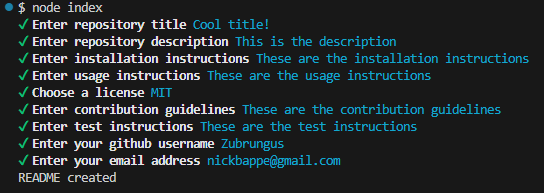

# README Generator

## Table of contents
- [Description](#description)
- [Installation](#installation)
- [Usage](#usage)
- [License](#license)
- [Questions](#questions)
## Description
A node.js application that assists with creating a README for a repository
## Installation
Clone this repository to your local machine 
## Usage
Navigate to the cloned repository and run "node index" to begin the process. Simply follow the prompts in order to generate your repository's README.\
Video demonstrating functionality: https://drive.google.com/file/d/16eQ8NFRT4_Cw6Ttz9XVcCJAe7PNvgepA/view\

## License
This software is covered under the GNU GPL V3 license
## Questions
- My Github profile is https://github.com/zubrungus
- I can be reached at nickbappe@gmail.com
